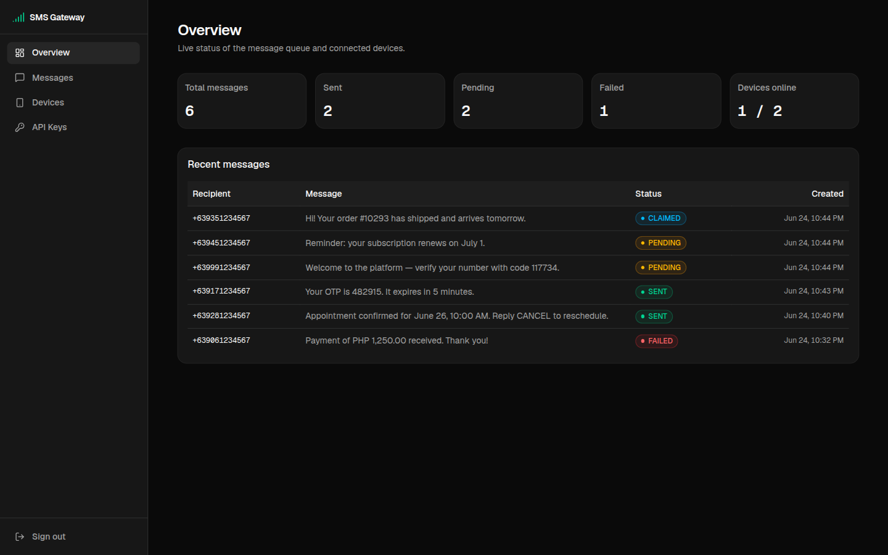
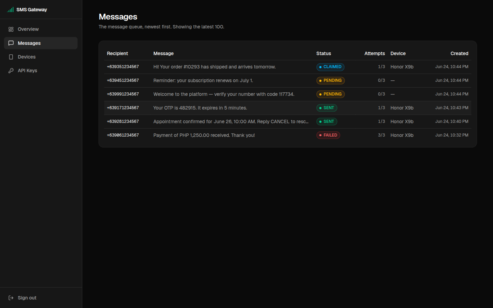
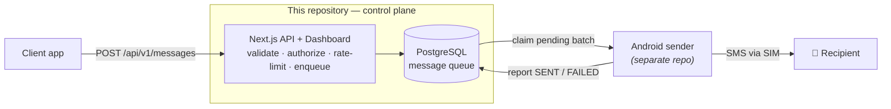
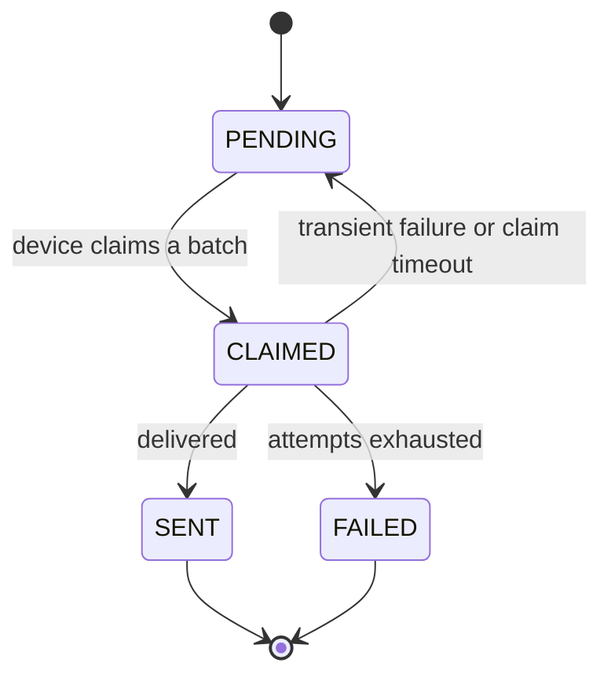

<div align="center">

# 📱 SMS Gateway

**Send SMS through your own Android phone's promo SIM instead of paying a commercial provider.**

Clients POST messages to an HTTP API; messages are queued in PostgreSQL; a companion
Android app claims pending messages, sends them over the cellular network, and reports
status back. A Twilio alternative you fully own and self-host.

[](https://nextjs.org)
[](https://react.dev)
[](https://www.typescriptlang.org)
[](https://www.prisma.io)
[](https://www.postgresql.org)
[](https://www.docker.com)
[](https://vitest.dev)
[](LICENSE)

</div>

---

## Table of contents

- [📱 SMS Gateway](#-sms-gateway)
  - [Table of contents](#table-of-contents)
  - [Why](#why)
  - [Screenshots](#screenshots)
  - [Architecture](#architecture)
  - [Features](#features)
  - [Tech stack](#tech-stack)
  - [Project structure](#project-structure)
  - [Getting started](#getting-started)
    - [Prerequisites](#prerequisites)
    - [1. Install \& configure](#1-install--configure)
    - [2. Start PostgreSQL and apply migrations](#2-start-postgresql-and-apply-migrations)
    - [3. Create the admin account, a device, and API keys](#3-create-the-admin-account-a-device-and-api-keys)
    - [4. Run](#4-run)
    - [Full stack with Docker](#full-stack-with-docker)
  - [API reference](#api-reference)
    - [Enqueue a message — `POST /api/v1/messages`](#enqueue-a-message--post-apiv1messages)
    - [Gateway endpoints — used by the Android sender](#gateway-endpoints--used-by-the-android-sender)
  - [Message lifecycle](#message-lifecycle)
  - [Testing](#testing)
  - [Scripts](#scripts)
  - [Configuration](#configuration)
  - [Security](#security)
  - [Roadmap](#roadmap)
  - [License](#license)

## Why

Commercial SMS APIs charge per message. If you already have a phone with an unlimited-text
promo (e.g. Globe/TM in the Philippines), you can turn it into your own SMS sender and pay
nothing per message. This repository is the **control plane**: a web dashboard, an HTTP API,
and a PostgreSQL-backed message queue. The Android sender that physically transmits the texts
lives in a **separate repository**.

## Screenshots

| Overview | Messages |
| :------: | :------: |
|  |  |

## Architecture



- **Control plane (this repo)** — Next.js 16 App Router, React 19, TypeScript, Tailwind v4,
  shadcn/ui. Prisma 7 (driver-adapter model over `@prisma/adapter-pg`) on PostgreSQL.
- **Sender (separate repo)** — an Android/Kotlin foreground service that polls the gateway,
  sends via the device's default SMS SIM, and reports delivery back.

## Features

- **HTTP API** to enqueue messages, with request validation (Zod) and structured JSON errors.
- **PostgreSQL-backed queue** with an explicit lifecycle: `PENDING → CLAIMED → SENT | FAILED`,
  bounded retries (`attempts` / `maxAttempts`), and indexes tuned for the device claim query.
- **Atomic claim & report** — the device's poll and result endpoints use `SELECT … FOR UPDATE`
  inside a transaction, eliminating double-send race conditions (TOCTOU).
- **Scoped API keys** — every key is either a `client` key (may only enqueue) or a `gateway` key
  (may only claim and report), so a leaked key can never cross into the other role's surface.
- **Self-healing queue** — a claim-timeout reaper returns messages stranded by a dead or offline
  device back to `PENDING` (consuming a retry), so nothing is silently stuck.
- **Rate limiting on every endpoint** — per API key for the `v1` routes, per client IP for `auth`
  routes — plus a **5-attempt / 15-minute** authentication lockout and an optional **daily send
  quota** per key (enforced atomically).
- **Secure auth on every layer** — `sk_live_`-prefixed API keys (only a SHA-256 hash is stored,
  compared in constant time) for the API; a single-admin JWT session cookie (httpOnly,
  `SameSite=strict`) for the dashboard, with the admin password hashed via `scrypt`.
- **PH mobile normalization** — any input form (`09xx`, `+63…`, `63…`, `9xx`) is normalized to
  E.164 at the API boundary before it is persisted.
- **Operational dashboard** — live queue stats, recent messages, devices, and API-key management.
- **Production Docker image** — multi-stage build, standalone Next.js output, one-shot migrator,
  non-root runtime.

## Tech stack

| Layer        | Choice                                                             |
| ------------ | ----------------------------------------------------------------- |
| Framework    | Next.js 16 (App Router), React 19, TypeScript                     |
| UI           | Tailwind CSS v4, shadcn/ui, dark mode                             |
| Data         | PostgreSQL, Prisma 7 with the `@prisma/adapter-pg` driver adapter  |
| Validation   | Zod                                                               |
| Auth         | `jose` (HS256 JWT cookie) + Node `scrypt`; SHA-256 hashed API keys |
| Tests        | Vitest                                                            |
| Deployment   | Docker / docker-compose                                           |

## Project structure

```text
src/
├─ app/
│  ├─ (dashboard)/      # authenticated dashboard pages (overview, messages, devices, keys)
│  ├─ api/              # HTTP API route handlers (auth + v1)
│  └─ login/            # sign-in page
├─ components/          # shadcn/ui primitives + layout components
├─ lib/                 # framework-agnostic domain logic
│  ├─ auth/             # API-key / admin / session primitives, key scopes
│  └─ sms/              # phone normalization, status lifecycle, retry rules
├─ server/              # server-only code (never imported by the client)
│  ├─ auth/             # request authorization, login throttle
│  ├─ services/         # data-access services (message, gateway, stats, …)
│  └─ validation/       # Zod schemas
└─ generated/prisma/    # generated Prisma client (gitignored)

prisma/                 # schema.prisma + migrations
scripts/                # admin / device / API-key CLIs
```

## Getting started

### Prerequisites

- Node.js 20 or newer
- Docker (for PostgreSQL), or a PostgreSQL instance you manage yourself

### 1. Install & configure

```bash
git clone https://github.com/ijanvincent/sms.git
cd sms
npm install
cp .env.example .env        # then edit the values
```

> [!IMPORTANT]
> **The Prisma client is generated, not committed.** After a fresh clone (or any schema change)
> you must run `npx prisma generate`, or imports from `@/generated/prisma/*` will fail.

```bash
npx prisma generate
```

### 2. Start PostgreSQL and apply migrations

```bash
docker compose up -d db     # just the database, for local dev
npx prisma migrate deploy   # apply migrations
```

### 3. Create the admin account, a device, and API keys

```bash
npm run admin:create  -- "admin" "<a-strong-password>"  # prints ADMIN_USERNAME / ADMIN_PASSWORD_HASH → put in .env
npm run device:create -- "My phone" "TM"                # registers a sender device, prints its deviceId
npm run key:create    -- "My backend"                   # issues a client key (enqueue) — raw key shown once
npm run key:create    -- "My phone" gateway             # issues a gateway key for the Android sender
```

> [!TIP]
> Prefer reproducible fixtures? `npm run db:seed` re-creates known development devices
> idempotently — handy after a `prisma migrate reset` or `docker compose down -v`.

### 4. Run

```bash
npm run dev                 # http://localhost:3000
```

Open the dashboard, sign in with your admin credentials, and you are ready to queue messages.

### Full stack with Docker

```bash
docker compose up --build   # db + one-shot migrator + web, production-style
```

The web service is published on `WEB_PORT` (default `3100`) → **http://localhost:3100**. The
container always listens on `3000` internally; `WEB_PORT` only sets the host mapping so it never
collides with a local `next dev` on `3000`.

## API reference

All API requests authenticate with a Bearer token: `Authorization: Bearer sk_live_…`.
Keys are **scoped** — a `client` key may call `POST /api/v1/messages`, while a `gateway` key may
call the gateway poll/result endpoints. Using a key outside its scope returns `403 insufficient_scope`.
Responses are JSON; errors follow:

```jsonc
{ "error": { "code": "<string>", "message": "<string>", "details"?: <any> } }
```

### Enqueue a message — `POST /api/v1/messages`

Requires a **`client`**-scoped key.

```bash
curl -X POST http://localhost:3000/api/v1/messages \
  -H "Authorization: Bearer sk_live_xxx" \
  -H "Content-Type: application/json" \
  -d '{ "recipient": "09171234567", "body": "Hello from my own gateway!" }'
```

```jsonc
// 202 Accepted
{ "id": "clx…", "status": "PENDING", "recipient": "+639171234567", "createdAt": "…" }
```

`429` (with a `Retry-After` header) is returned when the per-key rate limit or daily quota is exceeded.

### Gateway endpoints — used by the Android sender

Require a **`gateway`**-scoped key; rate-limited per key.

| Method & path                               | Purpose                                                                |
| ------------------------------------------- | ---------------------------------------------------------------------- |
| `POST /api/v1/gateway/poll`                 | Atomically claim a batch of pending messages for a device (also reaps stale claims). |
| `POST /api/v1/gateway/disconnect`           | Mark a sender device offline immediately during a clean gateway stop.                 |
| `POST /api/v1/gateway/messages/{id}/result` | Report the outcome (`SENT` / `FAILED` + reason) of a claimed message.  |

## Message lifecycle



A `CLAIMED` message returns to `PENDING` either when the device reports a transient failure, or
when the **claim-timeout reaper** finds it abandoned (device died mid-send). Each requeue consumes
one attempt; once `attempts` reach `maxAttempts`, the message lands in `FAILED`.

`MESSAGE_STATUS` / `isMessageStatus()` (`src/lib/sms/status.ts`) are the single source of truth
for status values — never hardcode the strings.

## Testing

Tests run on [Vitest](https://vitest.dev) and cover the pure, database-free domain and server
logic — phone normalization, the retry/status state machine, the fixed-window limiter, API-key
scopes, and the login throttle.

```bash
npm run test          # run once
npm run test:watch    # watch mode
```

> Service code that hits PostgreSQL is exercised manually against a local database; there is no
> DB-integration test harness yet (see [Roadmap](#roadmap)).

## Scripts

| Command                 | Description                              |
| ----------------------- | ---------------------------------------- |
| `npm run dev`           | Start the dev server (`:3000`)           |
| `npm run build`         | Production build (standalone output)     |
| `npm run start`         | Serve a production build                 |
| `npm run lint`          | ESLint                                   |
| `npm run test`          | Run the Vitest suite                     |
| `npm run db:seed`       | Seed idempotent development fixtures      |
| `npm run admin:create`  | Create the dashboard admin credential    |
| `npm run device:create` | Register a sender device                 |
| `npm run key:create`    | Issue an API key (raw key printed once)  |

## Configuration

Configuration is read from `.env` (see [`.env.example`](.env.example)). Key variables:

| Variable              | Description                                                                 |
| --------------------- | -------------------------------------------------------------------------- |
| `DATABASE_URL`        | PostgreSQL connection string (composed from the `POSTGRES_*` values below). |
| `POSTGRES_USER`       | PostgreSQL role used by the database container.                             |
| `POSTGRES_PASSWORD`   | Password for that role.                                                      |
| `POSTGRES_DB`         | Database name.                                                               |
| `AUTH_SECRET`         | Secret that signs the dashboard session JWT (`openssl rand -hex 32`).        |
| `ADMIN_USERNAME`      | Dashboard admin username.                                                    |
| `ADMIN_PASSWORD_HASH` | `scrypt` hash of the admin password (generated by `npm run admin:create`).   |
| `WEB_PORT`            | Host port the Dockerized web service is published on (default `3100`).       |

> [!WARNING]
> Never commit `.env`. Secrets and raw API keys are never logged.

## Security

- **API keys** — only the SHA-256 hash is stored; presented keys are hashed and compared with
  `timingSafeEqual`. Raw keys are shown once at creation and never again. Each key is scoped
  (`client` vs `gateway`) and may only reach its own endpoints.
- **Dashboard auth** — single-admin login, `scrypt`-hashed password, short-lived HS256 JWT
  (algorithm-pinned on verify) in an httpOnly, `SameSite=strict` cookie. Pages are gated by an
  edge `proxy` **and** re-checked server-side in the dashboard layout.
- **Rate limiting (project standard)** — every API endpoint is rate-limited: the `v1` routes per
  API key, the `auth` routes per client IP. **Authentication is additionally capped at 5 failed
  attempts per 15 minutes** per caller, with a spoof-proof global backstop, so credential
  brute-forcing is bounded regardless of the per-caller key.
- **Hardening headers** — a Content-Security-Policy plus `HSTS`, `X-Frame-Options: DENY`,
  `X-Content-Type-Options: nosniff`, `Referrer-Policy`, and `Permissions-Policy` on every response.
- **Defense in depth** — input validation at every boundary, an optional atomically-enforced daily
  quota, and atomic queue operations to prevent duplicate sends.

> [!NOTE]
> For a production deployment, terminate **TLS** in front of the app (the session cookie is
> `secure` and HSTS is set), set strong secrets, and run behind a trusted reverse proxy that
> controls `X-Forwarded-For`.

## Roadmap

The project/system is **active**. The Android sender app lives in a separate repository. The
claim-timeout reaper (returning stuck `CLAIMED` messages to `PENDING`) ships in this repo.

Planned:

- [ ] Client-facing message-status endpoint (query delivery outcome)
- [ ] Delivery webhooks
- [ ] DB-integration test harness

## License

Released under the [MIT License](LICENSE).
